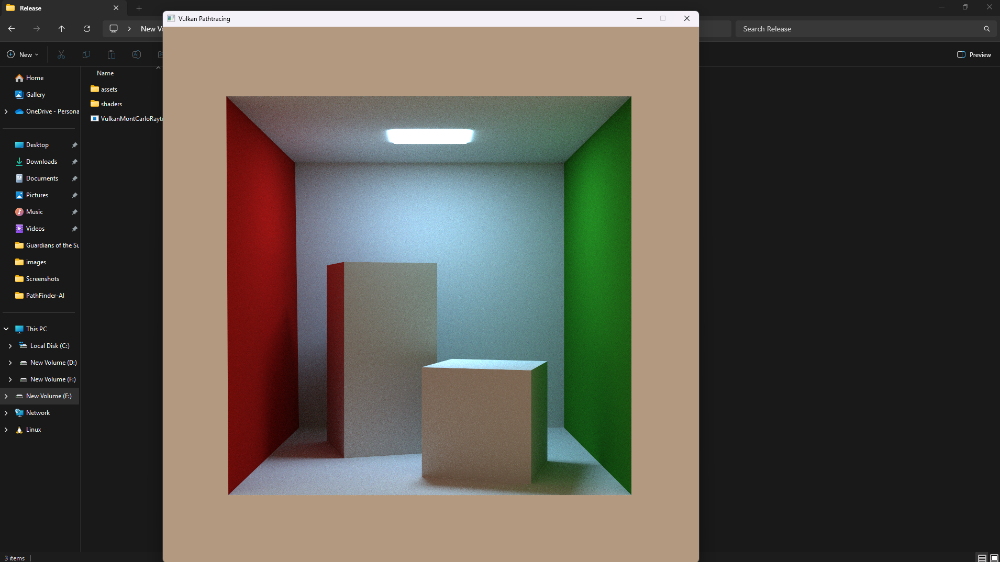

# 🌌 Vulkan Ray Tracing Engine using Monte Carlo Integration

> A physically-based ray tracing engine built with Vulkan, GLM, and SPIR-V, leveraging Monte Carlo integration and cosine-weighted hemisphere sampling for photorealistic global illumination.

---

## 🎯 Overview

This project simulates realistic light transport in 3D scenes using Monte Carlo Ray Tracing implemented through Vulkan's ray tracing extensions. It captures complex lighting effects including:

- Global Illumination
- Soft Shadows
- Reflections & Refractions
- Caustics

The engine utilizes GPU acceleration via NVIDIA RTX cores to render high-resolution scenes in real time.

---

## ⚙️ Features

- ✅ Physically-Based Rendering using the **Rendering Equation**
- ✅ **Monte Carlo Integration** for light sampling
- ✅ **Cosine-weighted hemisphere sampling** for variance reduction
- ✅ Vulkan **RT pipeline** with support for:
  - Acceleration Structures (BLAS/TLAS)
  - Raygen, Closest-Hit, Miss shaders
  - Shader Binding Tables
- ✅ Real-time performance on modern GPUs
- ✅ Python prototype for algorithm validation

---

## 📐 Rendering Equation

\[
L_o(x, \omega_o) = L_e(x, \omega_o) + \int_\Omega f_r(x, \omega_i, \omega_o) L_i(x, \omega_i)(\omega_i \cdot n) \, d\omega_i
\]

Approximated by Monte Carlo integration:

\[
L_o(x, \omega_o) \approx \frac{1}{N} \sum_{i=1}^{N} \frac{f_r(x, \omega_i, \omega_o) L_i(x, \omega_i)(\omega_i \cdot n)}{p(\omega_i)}
\]

- \( f_r \): BRDF
- \( p(\omega_i) \): PDF (cosine-weighted)
- \( N \): number of samples per pixel

---

## 🚀 Performance

| Method         | Time (480p frame) | Quality           |
|----------------|-------------------|--------------------|
| **Vulkan (GPU)** | ~1 second         | ✅ Low noise        |
| Python (CPU)   | ~24 hours         | 🟨 High noise       |

Monte Carlo integration benefits from GPU parallelism, allowing real-time rendering with over 1000 samples per pixel.

---

